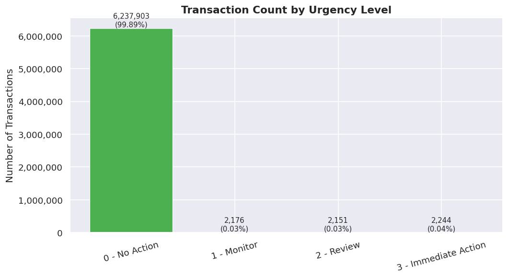
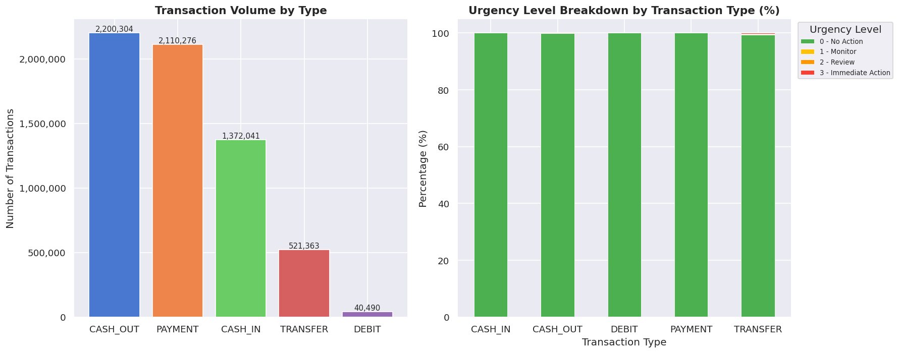
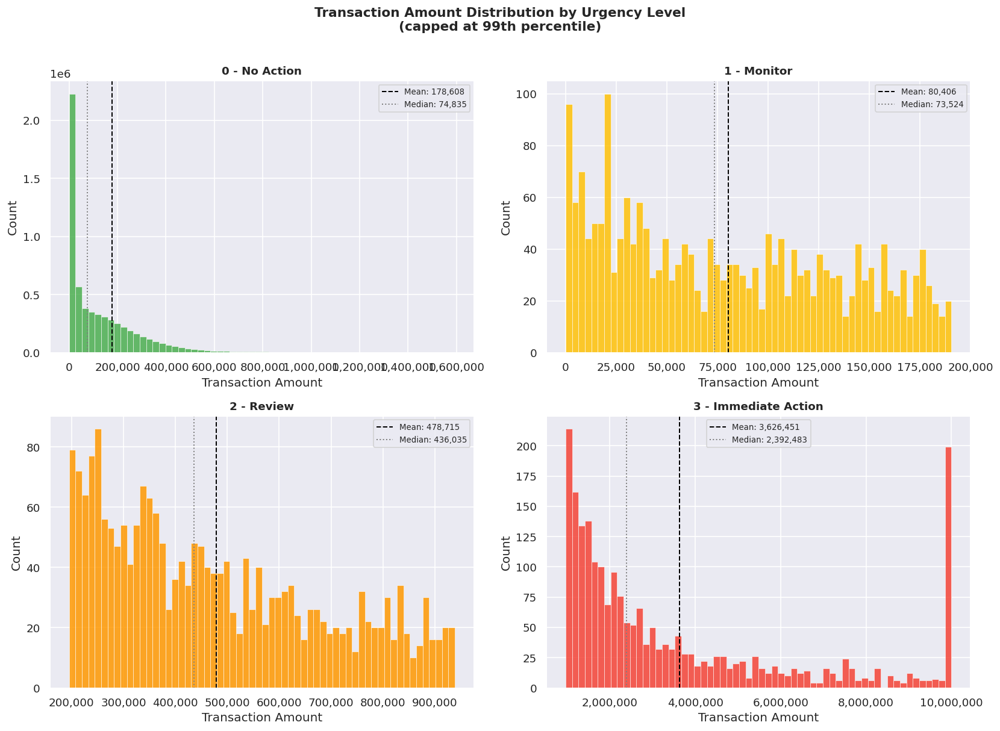
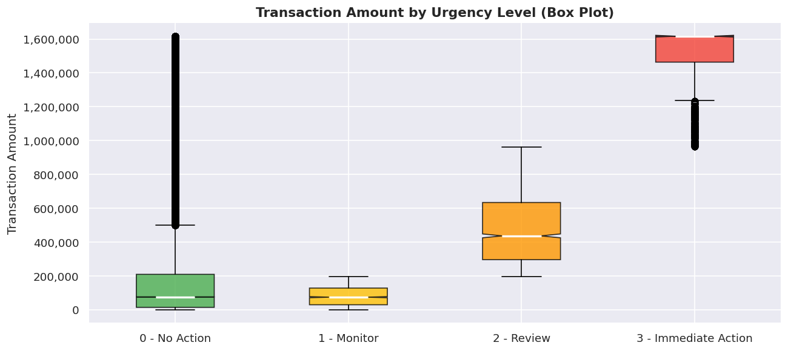
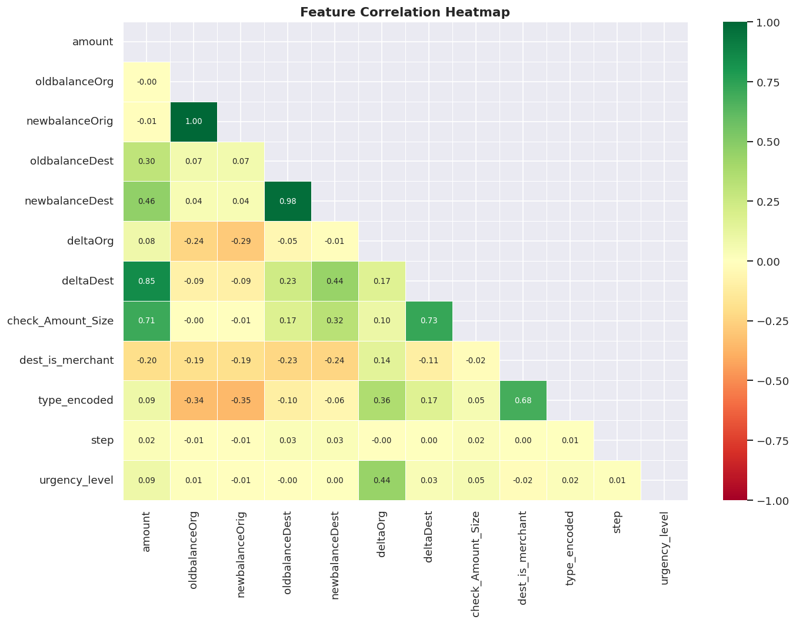
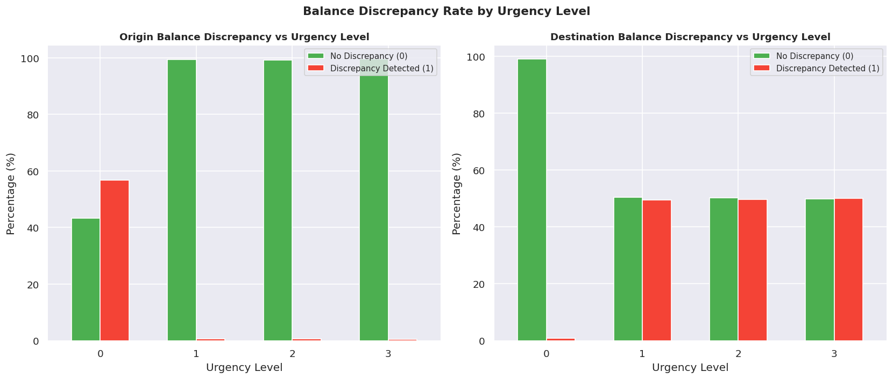
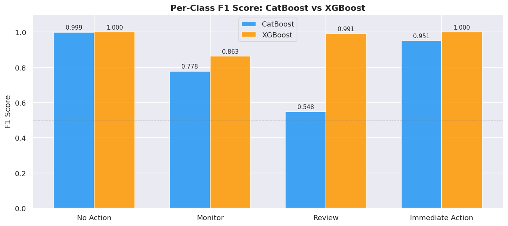
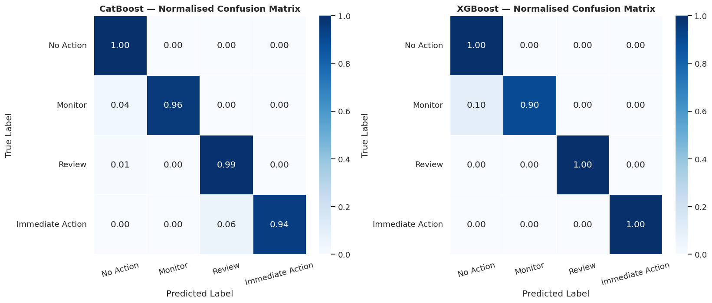
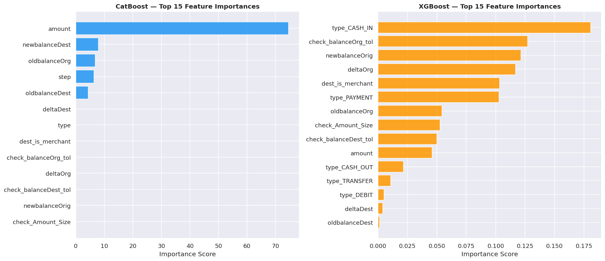
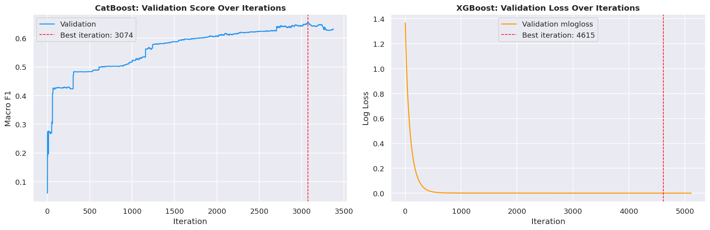

# Fraud Detection: Multi-Class Urgency Classification
Python | pandas | NumPy | scikit-learn | XGBoost | CatBoost | Machine Learning | Google Colab

A machine learning project that predicts the **investigation urgency level** of financial transactions, ranging from no action required to immediate intervention.

Originally built as a team submission for **HackML 2026** on Kaggle. This repository is my personal continuation of that work, with refactored code, improved structure, and ongoing experimentation.


## Table of Contents
- [Problem Statement](#problem-statement)
- [Dataset](#dataset)
- [Project Structure](#project-structure)
- [Exploratory Data Analysis](#exploratory-data-analysis)
- [Predictive Modeling](#predictive-modeling)
- [Final Conclusion](#final-conclusion)
- [How to Run the Project](#how-to-run-the-project)


## Problem Statement

Financial institutions process millions of transactions daily, yet only a small fraction are fraudulent. Rather than asking *"Is this fraud?"*, fraud teams must decide **how urgently** a transaction needs investigation, given limited analyst resources.

**Type:** Supervised Multi-Class Classification  
**Target Variable:** urgency_level (0–3)

| Label | Description | Business Context |
|-------|-------------|-----------------|
| 0 | No Action | Transaction appears legitimate |
| 1 | Monitor | Low-risk suspicious activity |
| 2 | Review | Likely fraud requiring analyst review |
| 3 | Immediate Action | High-risk fraud requiring urgent response |

The dataset is intentionally **imbalanced**, reflecting real-world fraud distributions. Models are evaluated on **Macro F1-score**, which treats all urgency levels equally and prevents ignoring rare but critical fraud cases.


## Dataset

Each row represents a single anonymized transaction from a simulated payment system (PaySim).

**Raw features (data/train.csv):**

| Feature | Description |
|---------|-------------|
| step | Time step (1 step = 1 hour) |
| type | Transaction type: CASH_IN, CASH_OUT, DEBIT, PAYMENT, TRANSFER |
| amount | Transaction amount in local currency |
| oldbalanceOrg | Origin account balance before transaction |
| newbalanceOrig | Origin account balance after transaction |
| oldbalanceDest | Destination account balance before transaction |
| newbalanceDest | Destination account balance after transaction |
| nameOrig | Anonymized origin account ID |
| nameDest | Anonymized destination account ID |
| urgency_level | **Target**: investigation urgency (0–3) |

**Engineered features (outputs/train_with_new_features.csv):**

After running data_preprocessing.ipynb, 6 additional columns are added to the raw data:

| Feature | Description |
|---------|-------------|
| check_balanceOrg_tol | Flag — did the origin balance not update correctly for this transaction type? |
| check_balanceDest_tol | Flag — did the destination balance not update correctly? |
| check_Amount_Size | Flag — is this transaction in the top 0.1% by amount? |
| deltaOrg | Net change in origin account balance |
| deltaDest | Net change in destination account balance |
| dest_is_merchant | Flag — is the destination a merchant account? |

The enriched CSVs (train_with_new_features.csv, test_with_new_features.csv) are saved to outputs/ and used as input for model training.


## Project Structure

```
fraud-detection-classification/
│
├── data/
│   ├── train.csv                      # Raw training data
│   └── test.csv                       # Raw test data
├── images/                            # EDA and model evaluation plots
├── outputs/                           # Generated CSVs and CatBoost logs
├── jupyter_notebook_files/
│   ├── eda.ipynb                      # Exploratory data analysis and visualizations
│   ├── data_preprocessing.ipynb       # Feature engineering pipeline
│   └── model_evaluation.ipynb         # Model training, evaluation, and submission
├── python_files/
│   └── data_fraud.py                  # EDA exploration script
├── requirements.txt
├── .gitignore
└── README.md
```


## Exploratory Data Analysis

Full EDA with code and visualizations is in jupyter_notebook_files/eda.ipynb.


### Class Distribution



The dataset is extremely imbalanced. Out of 6,244,474 total transactions, 99.89% are class 0 (No Action). The three fraud classes each account for only 0.03–0.04% of the data:

| Urgency Level | Count | Share |
|---|---|---|
| 0 — No Action | 6,237,903 | 99.89% |
| 1 — Monitor | 2,176 | 0.03% |
| 2 — Review | 2,151 | 0.03% |
| 3 — Immediate Action | 2,244 | 0.04% |

This extreme imbalance means a naive model that always predicts class 0 would achieve 99.89% accuracy while being completely useless for fraud detection. This is why Macro F1-score is the evaluation metric of choice, as it computes F1 independently for each class and averages them, treating all urgency levels equally regardless of how rare they are. It also means that class weights or sample weights are needed during training to prevent the model from simply ignoring the minority classes.


### Transaction Type Breakdowns



CASH_OUT is the most common transaction type (2,200,304), followed closely by PAYMENT (2,110,276) and CASH_IN (1,372,041). TRANSFER (521,363) and DEBIT (40,490) are far less frequent.

The stacked percentage chart shows that all transaction types are nearly 100% class 0, reflecting the overall dataset imbalance. However, the small amount of fraud that does exist is spread across all types rather than concentrated in one. This means that type alone cannot identify fraud, but it remains an important feature when combined with other signals. In particular, TRANSFER and CASH_OUT transactions involve direct money movement between accounts, making them inherently higher risk than CASH_IN or PAYMENT.


### Amount Distributions by Urgency Level




Transaction amounts increase dramatically with urgency level:

| Urgency Level | Mean Amount | Median Amount |
|---|---|---|
| 0 — No Action | 178,608 | 74,835 |
| 1 — Monitor | 80,406 | 73,524 |
| 2 — Review | 478,715 | 436,035 |
| 3 — Immediate Action | 3,626,451 | 2,392,483 |

Class 3 (Immediate Action) transactions have a mean amount of 3.6 million, roughly 20x higher than class 0. Notably, class 1 (Monitor) has a lower mean than class 0, suggesting that low-level suspicious activity does not necessarily involve large amounts. Classes 2 and 3 show a sharp jump, indicating that high-value transactions are a strong signal for serious fraud.

All distributions are right-skewed, so a small number of very large transactions pull the mean above the median. The gap between mean and median is largest for class 3 (3.6M vs 2.4M), indicating that extreme outlier amounts are especially common among the most urgent fraud cases. This justifies engineering a large transaction flag at the 99.9th percentile threshold as a feature.


### Correlation Heatmap



Looking at the bottom row (urgency_level), the features most correlated with the target are:

| Feature | Correlation with urgency_level |
|---|---|
| deltaOrg | 0.44 |
| check_Amount_Size | 0.05 |
| dest_is_merchant | -0.02 |
| step | 0.01 |

deltaOrg (net outflow from the origin account) is by far the strongest predictor at 0.44, confirming that large money movements out of an account are the clearest fraud signal in this dataset. check_Amount_Size and dest_is_merchant are weaker but still directionally useful.

Two notable multicollinearity findings: oldbalanceDest and newbalanceDest are correlated at 0.98, meaning they carry almost identical information and one is largely redundant. Similarly, deltaOrg and deltaDest capture the net balance change more cleanly than the raw balance columns, which is why they were engineered as features. step (time) has near-zero correlation with urgency, confirming that fraud occurs consistently across all time periods rather than spiking at particular hours.


### Balance Discrepancy Analysis



For each transaction type, there is an expected relationship between the old balance, the transaction amount, and the new balance, for example, a CASH_OUT should decrease the origin balance by exactly amount. A discrepancy flags where this relationship does not hold.

For the origin balance, class 0 has a discrepancy rate of ~57%, while classes 1–3 all drop to near 0%. This is a somewhat counterintuitive finding, it suggests that legitimate transactions are more likely to have minor balance irregularities (likely floating point rounding), while flagged transactions tend to have clean, exact balance updates. This may indicate that fraudulent transactions are carefully constructed to appear internally consistent.

For the destination balance, discrepancy rates are approximately 50/50 across classes 1–3, making it a weaker but still useful signal. Together, these flags add information that raw balance columns alone do not capture.


### Feature Engineering Pipeline

The raw data is enriched with 6 new features in data_preprocessing.ipynb and saved as train_with_new_features.csv and test_with_new_features.csv in outputs/. These enriched files are used as input for model training.

| Feature | Description | Motivation from EDA |
|---|---|---|
| check_balanceOrg_tol | Flag: origin balance did not update as expected | Discrepancy rate differs significantly across urgency levels |
| check_balanceDest_tol | Flag: destination balance did not update as expected | Adds signal for TRANSFER and DEBIT transactions |
| deltaOrg | Net change in origin account balance | Strongest single predictor of urgency (r = 0.44) |
| deltaDest | Net change in destination account balance | Less redundant than raw balance columns |
| check_Amount_Size | Flag: transaction is in the top 0.1% by amount | Class 3 mean amount is 20x higher than class 0 |
| dest_is_merchant | Flag: destination is a merchant account | Merchant destinations are associated with lower urgency |


## Predictive Modeling

Both models are trained and evaluated in jupyter_notebook_files/model_evaluation.ipynb, which covers training, per-class F1 breakdown, confusion matrices, feature importance, learning curves, and final submission generation.


### Approach

A time-based train/validation split is used, so the last 20% of time steps are held out as a validation set. This simulates real deployment where a model is trained on historical transactions and evaluated on more recent ones it has never seen, which is more realistic than a random split.

Class Imbalance Handling:
- Inverse-frequency class weights applied during training, rare fraud classes are upweighted so the model does not simply ignore them. The resulting weights were: class 0 (0.3), class 1 (919.4), class 2 (977.7), class 3 (962.6)
- Macro F1-score used as the primary evaluation metric to treat all urgency levels equally
- The notebook was run on Google Colab with a T4 GPU to handle the full 6.2 million row dataset


### CatBoost

CatBoost handles the transaction type column natively as a categorical feature without any encoding. It uses early stopping with 100-iteration patience and converged at iteration 2,206.


### XGBoost

XGBoost requires the type column to be one-hot encoded before training. Per-row sample weights are applied to handle class imbalance, and early stopping is used. XGBoost converged at iteration 4,615, taking longer but achieving significantly better results.


### Results



| Model | Macro F1 | F1 — No Action | F1 — Monitor | F1 — Review | F1 — Immediate Action |
|-------|----------|----------------|--------------|-------------|----------------------|
| CatBoost | 0.8189 | 0.9993 | 0.7775 | 0.5479 | 0.9510 |
| XGBoost | 0.9636 | 0.9999 | 0.8629 | 0.9915 | 1.0000 |

XGBoost outperforms CatBoost across every class, with the most dramatic difference on the Review class (0.9915 vs 0.5479). Looking at the full classification reports gives more insight into where each model struggles:

CatBoost has strong recall across all classes (0.96–1.00) but poor precision on Review (0.38), meaning it correctly finds almost all Review transactions but generates many false positives, flagging legitimate transactions as needing review. This is a meaningful operational problem: fraud analysts would waste time investigating transactions that aren't actually suspicious.

XGBoost achieves strong precision and recall across all classes. Its weakest point is Monitor precision (0.83), meaning roughly 1 in 6 transactions it flags for monitoring are actually legitimate, which is a much more acceptable false positive rate than CatBoost's Review precision of 0.38.


### Confusion Matrices



Both models classify No Action transactions perfectly (1.00). For CatBoost, the main error is on Immediate Action, where 6% of Immediate Action transactions are misclassified as Review, which means genuinely urgent fraud would be downgraded to a lower priority queue. XGBoost's only notable error is 10% of Monitor transactions being misclassified as No Action, which is a less dangerous mistake since Monitor is already the lowest-risk fraud class.


### Feature Importance



The two models weigh features very differently:

CatBoost is heavily dominated by amount (74.6 importance score), with newbalanceDest (7.97), oldbalanceOrg (6.76), and step (6.40) far behind. Most engineered features, including deltaOrg, check_balanceOrg_tol, and dest_is_merchant, register near-zero importance, suggesting CatBoost learned mainly from raw transaction values.

XGBoost spreads importance more evenly across features. type_CASH_IN (0.181) is the top feature, followed closely by check_balanceOrg_tol (0.127), newbalanceOrig (0.121), deltaOrg (0.117), and dest_is_merchant (0.103). This confirms that the engineered features from data_preprocessing.ipynb added genuine predictive value, and XGBoost was better able to exploit them.


### Learning Curves



CatBoost's Macro F1 improves steadily from 0.06 at iteration 0 to a peak of 0.819 at iteration 2,206, with a notable jump around iteration 2,000 where it began learning the harder minority classes. Training took approximately 6 minutes 21 seconds. XGBoost's log loss drops rapidly from 1.37 in the first 500 iterations down to near 0, then continues improving slowly all the way to its best iteration at 4,615, indicating it needed significantly more trees to reach its full potential on the minority classes.


## Final Conclusion

This project set out to predict the investigation urgency level of financial transactions, not just whether fraud occurred, but how urgently it needed to be acted on. That framing makes it a more realistic and operationally useful problem than binary fraud detection, and it introduces challenges that a standard classifier would struggle with: four classes, extreme imbalance (99.89% class 0), and the need to correctly prioritize the rarest and most critical cases.

XGBoost achieved a Macro F1 of 0.964, significantly outperforming CatBoost (0.819) across all urgency levels. The key driver of this gap was XGBoost's ability to leverage the engineered features from data_preprocessing.ipynb, particularly check_balanceOrg_tol, deltaOrg, and dest_is_merchant, which together account for over 35% of XGBoost's feature importance but register near-zero in CatBoost's rankings.

The most important finding from the feature importance analysis is that the engineered features genuinely mattered. XGBoost's top features are almost entirely derived columns rather than raw ones, validating the feature engineering work done in data_preprocessing.ipynb. CatBoost's over-reliance on the raw amount column likely explains its weaker performance on the Review class (F1 of 0.548 vs XGBoost's 0.991).

The precision and recall breakdown also reveals an important operational difference between the two models. CatBoost had high recall but poor precision on the Review class (0.38), meaning it flagged many legitimate transactions as suspicious, flooding the review queue with false positives. XGBoost maintained both high precision and recall across all classes, making it far more practical for a real fraud team working with limited analyst capacity.

Both models were trained on the full 6.2 million row dataset using inverse-frequency class weights (up to ~977x for the rarest class) to correct for the extreme imbalance, and run on Google Colab with a T4 GPU given the scale of the data. Both models learned to classify No Action transactions perfectly, and XGBoost achieved near-perfect scores across all four urgency levels.

If this project were extended further, the most promising directions would be: experimenting with a soft-voting ensemble combining CatBoost and XGBoost predictions, testing additional engineered features such as account-level transaction frequency and rolling amount windows, and submitting to the Kaggle leaderboard to benchmark performance against other competitors.


## How to Run the Project

1. Clone the repository:

```
git clone https://github.com/adamsilver2005/Fraud-Detection-Classification.git
cd Fraud-Detection-Classification
```

2. Install dependencies:

```
pip install -r requirements.txt
```

3. Place train.csv and test.csv inside the data/ folder.

4. Run the notebooks in order:

```
jupyter_notebook_files/eda.ipynb
jupyter_notebook_files/data_preprocessing.ipynb
jupyter_notebook_files/model_evaluation.ipynb
```

Note: data_preprocessing.ipynb must be run before model_evaluation.ipynb, as it generates train_with_new_features.csv and test_with_new_features.csv in outputs/ which are used as input for model training. model_evaluation.ipynb trains on the full 6.2 million row dataset and is recommended to run on Google Colab with a GPU runtime (Runtime → Change runtime type → T4 GPU) as it may take over an hour on a standard CPU.

## Attribution

This project originated as a team submission for **HackML 2026** on Kaggle, built collaboratively with [Peyton289](https://github.com/Peyton289), [TrentB159](https://github.com/TrentB159), and [ArwinSepahram](https://github.com/ArwinSepahram).

This repository is my personal continuation of that work with independent improvements and refactoring.

**Competition:** [FRAUD | HackML 2026](https://kaggle.com/competitions/fraud-hack-ml-2026)


